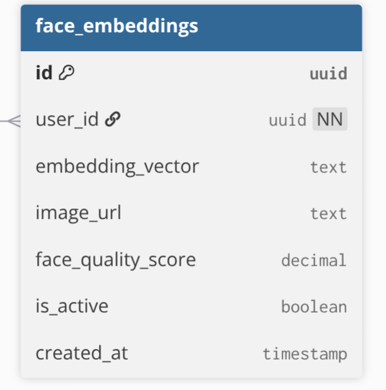
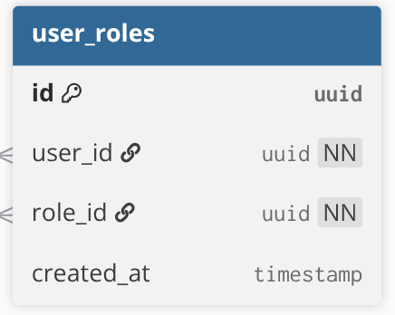
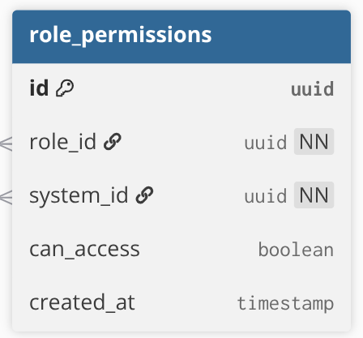
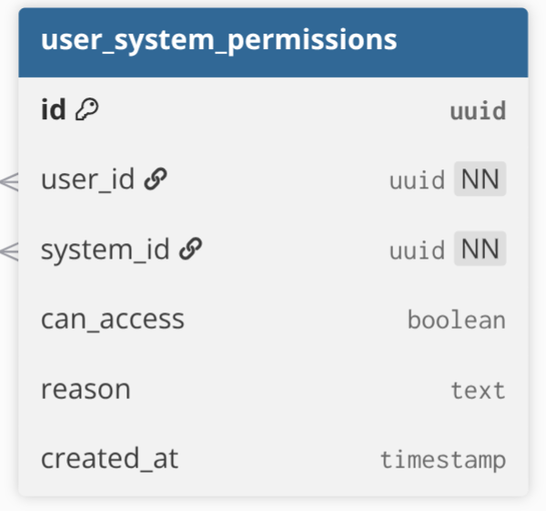
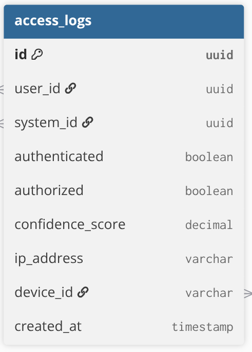

# 顔認証＋複数システム認可 API ドキュメント
# Face Authentication + Multi-System Authorization API Documentation

---

# 1. システム概要
# System Overview

このドキュメントは、顔認証ログインおよび複数システム認可の全体仕様について説明します。

This document describes the overall specification of the Face Authentication Login and Multi-System Authorization platform.

## 対象
## Scope

- 顔認証ログイン  
  Face authentication login

- ライブネス検知（まばたき・顔向き確認）  
  Liveness detection (blink + head turn verification)

- Blob動画アップロード認証  
  Blob video-based authentication

- システム別アクセス権限制御  
  System-based authorization

- JWTトークン発行  
  JWT generation

- アクセスログ記録  
  Access logging

---

# 2. 全体フロー
# Overall Flow

## システム全体フロー図
## Overall System Flow Diagram


---

## 処理概要
## Flow Summary

### 1. ログイン画面表示
### 1. Open Login Screen

ユーザーが WMS/TMS ログイン画面を開きます。  
User opens WMS/TMS login screen.

---

### 2. カメラ起動
### 2. Camera Starts

ブラウザでカメラが起動します。  
Frontend starts camera.

---

### 3. ライブネス確認
### 3. Liveness Verification

ユーザー本人確認のため以下を実施します。

Liveness verification is performed.

- Blink Detection
- Head Turn Detection

---

### 4. 5秒動画録画
### 4. Record 5-second Video

5秒間の動画を録画します。

Record 5-second face video.

---

### 5. Blob生成
### 5. Convert to Blob

録画した動画を Blob に変換します。

Convert recorded video into Blob object.

---

### 6. API送信
### 6. Send API Request

Blob動画をバックエンドへ送信します。

Blob video is sent to backend API.

---

### 7. 動画解析
### 7. Video Processing

サーバー側で動画フレーム抽出を行います。

Backend extracts frames from uploaded video.

---

### 8. 顔認証
### 8. Face Matching

抽出フレームから特徴量ベクトルを生成し、
登録済みデータと照合します。

Generate face embeddings from frames and compare against stored vectors.

---

### 9. 権限確認
### 9. Authorization Check

対象システムへのアクセス権限を確認します。

Check whether user can access requested system.

---

### 10. JWT生成
### 10. Generate JWT

認証成功後 JWT を発行します。

JWT is generated after successful authentication.

---

### 11. ログ保存
### 11. Save Access Log

ログイン結果を access_logs に保存します。

Authentication result is saved in access_logs.

---

### 12. ログイン完了
### 12. Login Success

ダッシュボードへ遷移します。

User is redirected to dashboard.

---

# 3. データベース構成
# Database Structure

## ER図
## ER Diagram


---

# 4. テーブル一覧
# Table Definitions

# users


ユーザー基本情報を保存します。  
Stores user information.

---

# face_embeddings



顔特徴量ベクトルを保存します。  
Stores facial embedding vectors.

---

# systems


WMS / TMS システム情報。  
Stores system information.

---

# roles


ロール定義。  
Stores role definitions.

---

# user_roles



ユーザーとロールの紐付け。  
Maps users to roles.

---

# role_permissions



ロール別アクセス権限。  
Role-based permissions.

---

# user_system_permissions



ユーザー個別権限 override。  
Per-user permission override.

---

# access_logs



ログイン履歴保存。  
Stores login history.

---

# 5. API Logic
# API Logic

## Endpoint

```http
POST /face-login
```

---

## Request

```json
{
  "video": "Blob (5 seconds)",
  "systemCode": "WMS"
}
```

---

## Response

```json
{
  "success": true,
  "token": "jwt_token_here",
  "user": {
    "id": "u_001",
    "name": "Rem"
  },
  "redirectTo": "/dashboard"
}
```

---

# 処理ロジック
# Processing Logic

```text
1. User opens login screen

2. Frontend starts camera

3. Blink detection runs

4. Head turn detection runs

5. Frontend records 5-second face video

6. Video converted into Blob

7. Blob uploaded to backend

8. Backend extracts frames from video

9. Face embeddings generated from extracted frames

10. Compare with stored face_embeddings

11. Return best matched user

12. Read requested systemCode

13. Check user_system_permissions

14. Check role_permissions

15. Generate JWT token

16. Insert access_logs

17. Return login response

18. Redirect to dashboard
```

---

# 6. 詳細クエリフロー
# Detailed Query Flow

## 詳細フロー図
## Detailed Flow Diagram


---

## Step 1 — Face Matching

```sql
SELECT
  user_id,
  embedding_vector
FROM face_embeddings
WHERE is_active = true;
```

動画から抽出した顔特徴量を比較します。  
Compare face embeddings extracted from video.

---

## Step 2 — Find System

```sql
SELECT id
FROM systems
WHERE code = 'WMS';
```

systemCode から対象システム取得。  
Find target system using systemCode.

---

## Step 3 — Check User Override Permission

```sql
SELECT can_access
FROM user_system_permissions
WHERE user_id = 'u_001'
AND system_id = 'sys_001';
```

ユーザー個別権限確認。  
Check explicit user override permission.

---

## Step 4 — Get Roles

```sql
SELECT role_id
FROM user_roles
WHERE user_id = 'u_001';
```

ユーザーロール取得。  
Retrieve assigned roles.

---

## Step 5 — Check Role Permissions

```sql
SELECT can_access
FROM role_permissions
WHERE role_id IN (...)
AND system_id = 'sys_001';
```

ロール権限確認。  
Check role-based permissions.

---

## Step 6 — Generate JWT

JWT生成。

JWT includes:

- userId
- roles
- accessible systems
- login timestamp

---

## Step 7 — Save Access Log

```sql
INSERT INTO access_logs (
  user_id,
  system_id,
  authenticated,
  authorized,
  confidence_score,
  created_at
)
VALUES (...);
```

ログ保存。  
Save access history.

---

## Step 8 — Return Response

ログイン成功レスポンス返却。

Return login success response.

---

# 7. Important Notes
# 重要ポイント

- 顔データは静止画ではなく **5秒動画 Blob** で送信されます  
  Face data is uploaded as a 5-second Blob video

- Blink Detection を実装しています  
  Blink detection is implemented

- Head Turn Detection を実装しています  
  Head turn detection is implemented

- サーバー側で動画からフレーム抽出後に顔照合を行います  
  Backend extracts frames before face matching

- user_system_permissions は role_permissions より優先されます  
  user permissions override role permissions

- JWT に roles / systems を含みます  
  JWT includes roles and accessible systems

- access_logs にすべてのログイン履歴を保存します  
  All login attempts are saved to access_logs

---

# 8. Future Improvements
# 今後の改善案

- Face recognition confidence tuning
```
