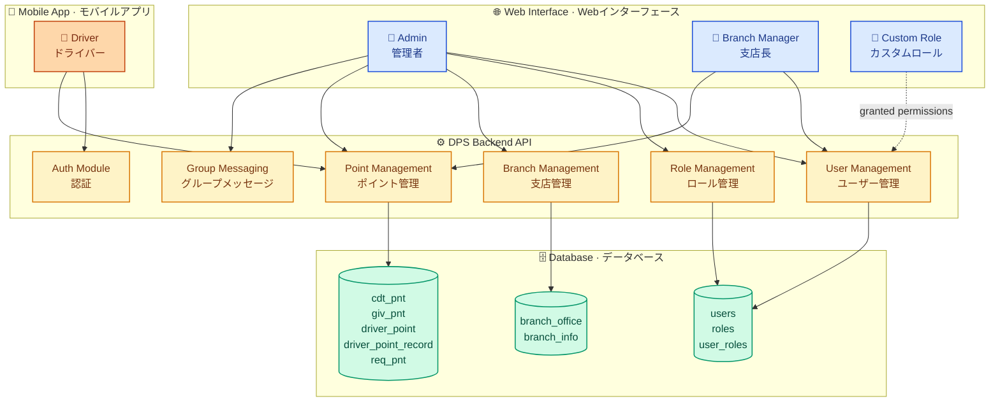
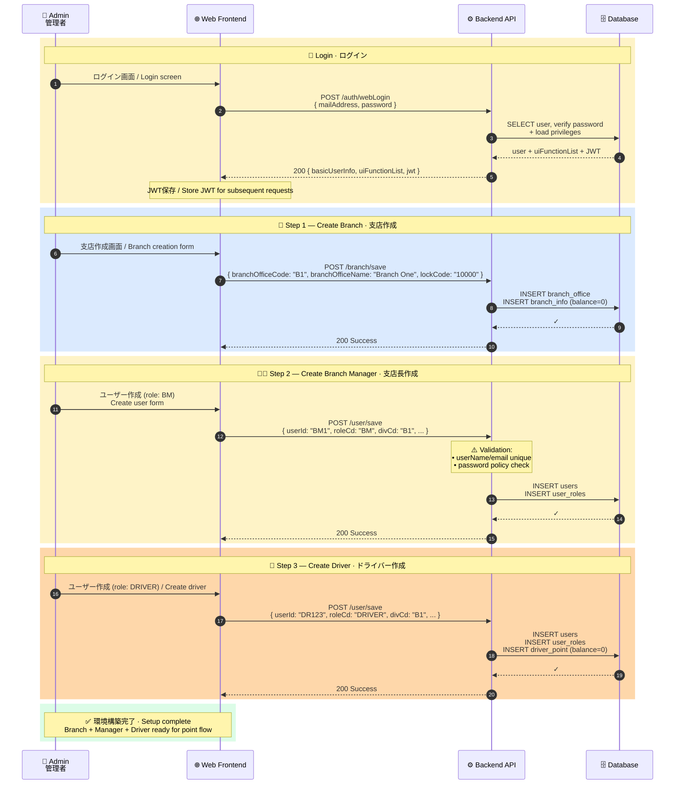
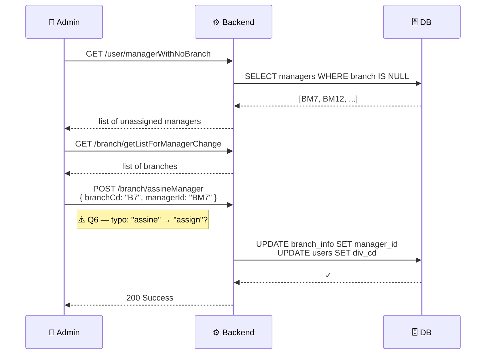
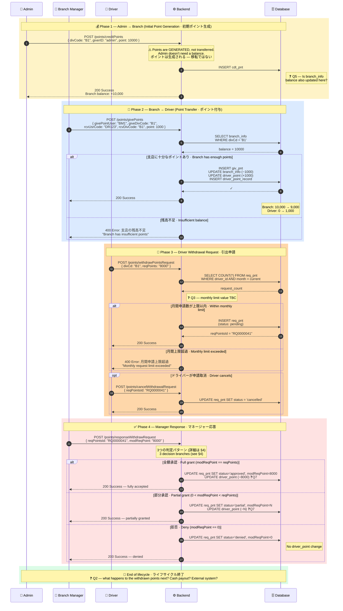
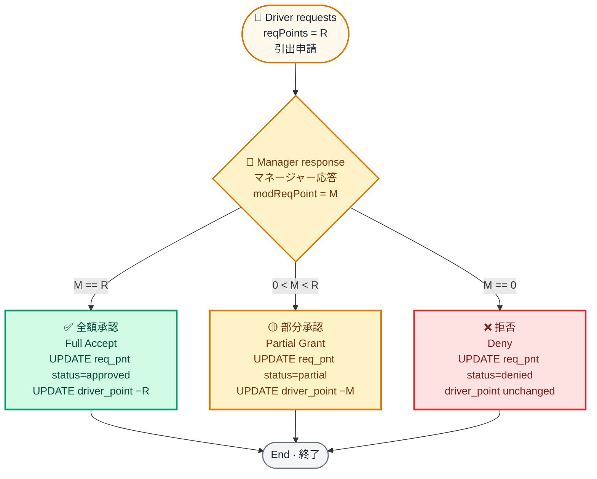
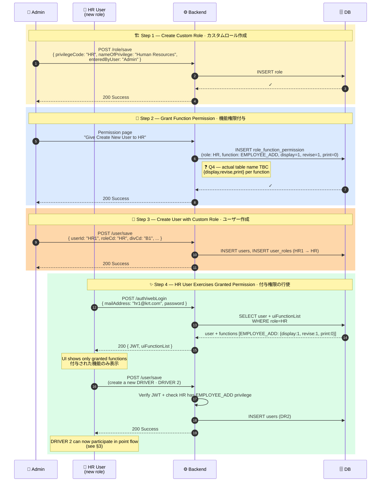
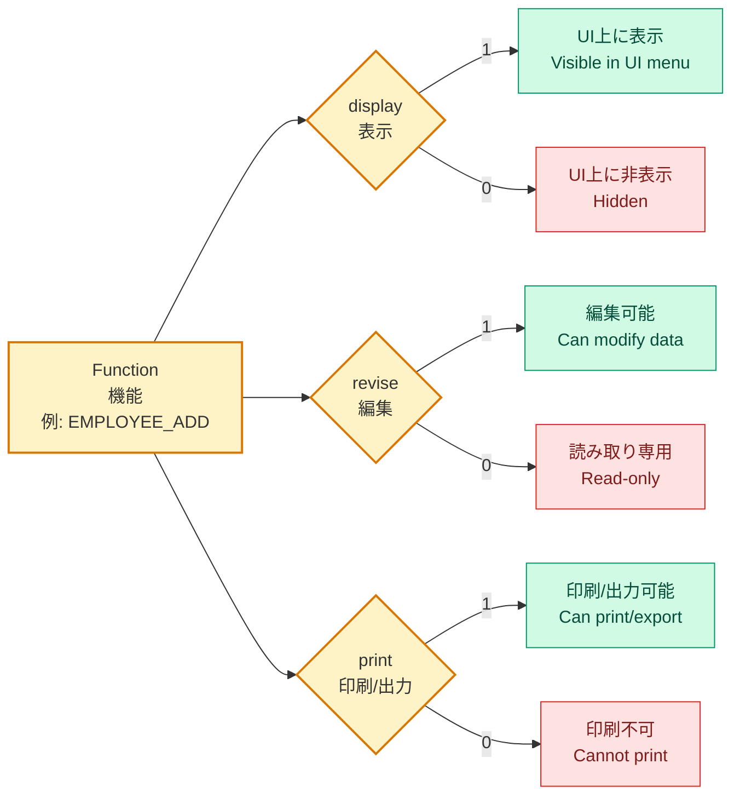
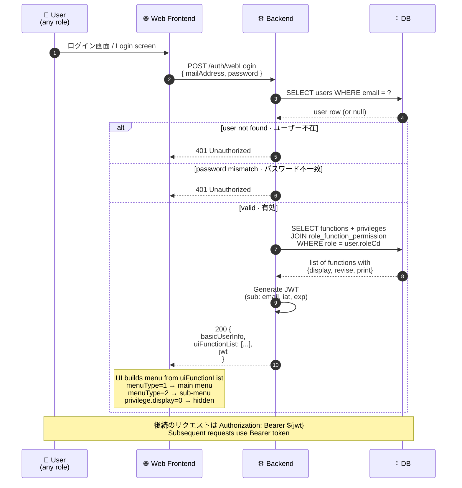

# 🚚 ドライバーポイントシステム · シーケンス図集

## Driver Point System (DPS) — Sequence Diagrams

> このドキュメントは DPS の内部仕様補足資料です。提供側・利用側・QAの3チームが共通の参照点として使用します。<br/>
> Supplementary documentation for DPS internals. Shared reference for producer, consumer, and QA teams.

すべての図は **Mermaid** 記法で書かれており、GitHub・GitLab・Notion・VSCode等で自動レンダリングされます。<br/>
All diagrams are written in **Mermaid** notation and render automatically in GitHub, GitLab, Notion, and VSCode.

---

## ⚠️ Errata & Open Questions · 未確認事項

このドキュメントを最終化する前に、提供側チームに確認が必要な項目です。図中の <code>❓</code> マーカーは未確認の箇所を示します。<br/>
*Items requiring producer-team confirmation before this doc is finalized. <code>❓</code> markers in diagrams indicate unconfirmed details.*

| # | 項目 / Item | 状態 / Status |
|:-:|---|---|
| Q1 | **Driver mobile login endpoint** — Doc shows `/auth/webLogin` but drivers are mobile-only. Face Auth confirmed separate. What's the driver mobile login endpoint? *(assumed `/auth/mobileLogin` in diagrams — please confirm)* | ❓ TBC |
| Q2 | **Post-withdrawal terminal state** — When manager approves, points are deducted from `driver_point`. Where do they go? Cash payout? Just removed? External payout system? | ❓ TBC |
| Q3 | **Monthly withdrawal limit** — Doc says "less than number of requests allowed per month" but doesn't give the number. Is it per-driver? Configurable per branch/role? | ❓ TBC |
| Q4 | **Permission model granularity** — Doc text says "give permission of function to role" (binary), but login response shows `{display, revise, print}` per function. Are both layers active? *(diagrams assume both)* | ❓ TBC |
| Q5 | **Branch balance update on credit** — When admin credits via `/points/creditPoints`, doc only says "Insert in cdt_pnt". Is `branch_info` also updated? *(diagrams assume yes — otherwise the give-to-driver step can't deduct from a non-existent balance)* | ❓ TBC |
| Q6 | **Endpoint naming inconsistencies in source doc:** `/user/deactivate` under Role Control API (typo for `/role/deactivate`?); `/branch/save` listed with both POST and PUT (PUT probably `/branch/update`?); `assineManager` (typo for `assignManager`?); `divCode` vs `divCd` vs `branchCode` used interchangeably. **Diagrams use the exact doc spelling — fix typos in source first, then update.** | ❓ TBC |
| Q7 | **Driver withdrawal deduction step** — Doc says points are deducted from driver on manager approval, but DB update list only mentions `Update req_pnt`. Where is the actual `driver_point` UPDATE? *(diagrams assume `driver_point` is also updated)* | ❓ TBC |

---

## 📋 Legend · 凡例

### Actors / アクター

| アイコン / Icon | アクター / Actor | 説明 / Description |
|:---:|---|---|
| 👤 | **Admin** 管理者 | スーパーユーザー · 全権限 / Super user with all permissions. Web only. |
| 🏢 | **Branch Manager** 支店長 | 支店を管理・ドライバーへポイント付与 / Manages branch, gives points to drivers. Web only. |
| 🚛 | **Driver** ドライバー | モバイルアプリのみ · ポイント受領と引出申請 / Mobile only. Receives points and requests withdrawals. |
| 👔 | **Custom Role** カスタムロール | 例: HR · 管理者が機能権限を付与 / e.g. HR. Admin grants function-level permissions. |
| 🌐 | **Web Frontend** Webフロント | Admin/Manager/Custom roles 用 |
| 📱 | **Mobile App** モバイルアプリ | Driver 専用 |
| ⚙️ | **Backend API** バックエンドAPI | DPS API server |
| 🗄️ | **Database** データベース | PostgreSQL / RDBMS |

### Entities / エンティティ

```
ROLE 担当       — ADMIN, BRANCH MANAGER, DRIVER (defaults, undeletable) + custom roles
BRANCH 営業所   — Organizational unit; holds point balance
USER ユーザー   — Belongs to a Branch; has a Role
```

### Phases / フェーズ色分け

```
🟦 Blue   — Client-side / クライアント側
🟨 Yellow — Authentication / 認証
🟧 Orange — Business logic / 業務ロジック
🟥 Red    — Failure paths / 失敗パス
🟩 Green  — Success / Response / 成功
```

---

## 1️⃣ システム概要 · System Overview

DPS の3つのコアエンティティと、各ロールがアクセスするインターフェースの関係です。<br/>
*The three core entities of DPS and the interfaces each role uses.*



### Role responsibility matrix · ロール責任マトリクス

| 機能 / Function | Admin 管理者 | Branch Manager 支店長 | Driver ドライバー | Custom Role カスタム |
|---|:-:|:-:|:-:|:-:|
| Create/edit roles ロール管理 | ✅ | ❌ | ❌ | ⚙️ if permitted |
| Create branches 支店作成 | ✅ | ❌ | ❌ | ⚙️ if permitted |
| Create users ユーザー作成 | ✅ | ❌ | ❌ | ⚙️ if permitted |
| Credit points to branch ポイント生成 (Admin→Branch) | ✅ | ❌ | ❌ | ⚙️ if permitted |
| Give points to driver ポイント付与 (Branch→Driver) | ❌ | ✅ | ❌ | ❌ |
| Request withdrawal 引出申請 | ❌ | ❌ | ✅ | ❌ |
| Approve/deny withdrawal 引出承認 | ❌ | ✅ | ❌ | ❌ |
| Group messaging グループメッセージ | ✅ | ❌ | ❌ | ⚙️ if permitted |

---

## 2️⃣ 環境構築フロー · Bootstrap / Entity Creation Flow

新規システム導入時に Admin が実行する初期セットアップです。**Branch を作成 → Manager 作成 → Driver 作成** の順で行います。<br/>
*Initial setup performed by Admin when onboarding a new tenant: **Branch → Manager → Driver** in that order.*



### Alternative: assign existing manager · 既存マネージャーの割当

マネージャーは支店なしで作成し、後から割当することも可能です。<br/>
*Managers can be created without a branch and assigned later.*



---

## 3️⃣ ポイントライフサイクル · Point Lifecycle (End-to-End)

**DPSの心臓部です。** ポイントが Admin から Branch、Branch から Driver、最終的に Driver の引出申請まで、4フェーズで流れます。<br/>
**The heart of DPS.** Points flow in 4 phases: Admin → Branch → Driver → withdrawal request → manager response.



---

## 4️⃣ 引出判定ロジック · Withdrawal Decision Logic

マネージャーの応答 (`modReqPoint`) によって、3つの異なる結果が生まれます。<br/>
*Manager's response (`modReqPoint`) produces one of three outcomes.*



### Concrete examples · 具体例

| シナリオ / Scenario | reqPoints | modReqPoint | 結果 / Result | DB change to `driver_point` |
|---|:-:|:-:|---|---|
| ドライバー満額受領 / Driver gets all | 8,000 | 8,000 | ✅ Approved | −8,000 |
| マネージャーが半額に修正 / Manager halves it | 8,000 | 4,000 | 🟡 Partial | −4,000 |
| マネージャーが拒否 / Manager denies | 8,000 | 0 | ❌ Denied | 0 (no change) |
| ドライバーがキャンセル / Driver cancels first | 8,000 | (n/a) | 🚫 Cancelled | 0 (no change) |

> **QA注意点 / QA edge cases:**
> - `modReqPoint > reqPoints` → should this error? Doc doesn't specify. **❓**
> - Concurrent: driver cancels while manager is responding → race condition handling? **❓**
> - Driver `driver_point` balance < approved amount at time of approval → what then? **❓**

---

## 5️⃣ RBAC フロー · Role-Based Access Control Flow

カスタムロール (例: HR) を作成し、特定の機能権限を付与する流れです。<br/>
*Create a custom role (e.g. HR) and grant it specific function permissions.*



### Privilege model · 権限モデル

各機能ごとに、3軸の権限フラグを持ちます。<br/>
*Each function has a three-axis privilege flag.*



> ❓ **Q4** — Doc text suggests simple "grant function to role" (binary). Login response shows `{display, revise, print}` (3-axis). Are both layers used, or did the doc text simplify the actual model? **Producer team to confirm.**

---

## 6️⃣ データベース関係図 · Database ER Diagram

DPSが参照する主要テーブルの関係です。<br/>
*Relationships between the main tables touched by DPS.*

```mermaid
%%{init: {
  'theme': 'base',
  'themeVariables': {
    'fontSize': '13px',
    'fontFamily': '"Helvetica Neue", "Hiragino Sans", "Yu Gothic", "Noto Sans JP", sans-serif',
    'primaryColor': '#FFF8EC',
    'primaryBorderColor': '#D97706'
  }
}}%%
erDiagram
    users ||--o{ user_roles : "has · 持つ"
    roles ||--o{ user_roles : "assigned to · 割当"
    branch_office ||--|| branch_info : "extends · 拡張"
    branch_info ||--o{ users : "houses · 所属"
    branch_info ||--o{ cdt_pnt : "credited by admin · 管理者により与えられる"
    branch_info ||--o{ giv_pnt : "source of · 元"
    users ||--o| driver_point : "if driver · ドライバーの場合"
    driver_point ||--o{ driver_point_record : "history · 履歴"
    users ||--o{ req_pnt : "requests · 申請"
    users ||--o{ giv_pnt : "receives · 受領"

    users {
        string userId PK
        string userName
        string passWd
        string roleCd FK
        string divCd FK "branch · 支店"
        string userSurnm
        string userGivnm
        string userSurnmk
        string userGivnmk
        string email
        string userSy "active/inactive"
        datetime createDt
    }
    roles {
        string privilegeCode PK
        string nameOfPrivilege
        string enteredByUser
        boolean isDefault "ADMIN/BM/DRIVER cannot delete"
    }
    user_roles {
        string user_id FK
        string role_id FK
    }
    branch_office {
        string divCd PK
        string divNm "branch name · 支店名"
        string lockCd "❓ purpose TBC"
        datetime createDt
        string createUs
    }
    branch_info {
        string divCd PK_FK
        int point_balance "❓ Q5 confirm"
        string manager_id FK
    }
    cdt_pnt {
        string id PK
        string divCode FK
        string giverID
        int point
        datetime createDt
    }
    giv_pnt {
        string id PK
        string givePointUser FK
        string giveDivCode FK
        string rcvUsrCode FK
        string rcvDivCode FK
        int point
        datetime createDt
    }
    driver_point {
        string user_id PK_FK
        int balance
    }
    driver_point_record {
        string id PK
        string user_id FK
        int delta "+ or −"
        string source "give/withdrawal"
        datetime createDt
    }
    req_pnt {
        string reqPointsId PK
        string user_id FK
        string divCd FK
        int reqPoints
        int modReqPoint "0=deny, =req=full, partial otherwise"
        string status "pending/approved/partial/denied/cancelled"
        datetime createDt
    }
```

> **Note:** Several column names above are inferred from request/response examples and may not match the actual schema. Producer team should validate against the real DDL.<br/>
> *上記の列名の一部はリクエスト/レスポンス例から推測されています。実際のDDLと照合してください。*

---

## 7️⃣ ログインと権限ロード · Login & Permission Loading

ログイン時に、ユーザーの権限が `uiFunctionList` として JWT と共に返却されます。フロントエンドはこれを使って UI を構築します。<br/>
*On login, user permissions are returned as `uiFunctionList` alongside the JWT. The frontend uses this to build the UI.*



### Sample `uiFunctionList` entry · エントリ例

```json
{
  "funcId": "EMPLOYEE_ADD",
  "funcName": "Add Employee",
  "funcNameJp": "従業員 追加",
  "landingPage": "employee/create",
  "menuType": "2",
  "displayOrder": 2,
  "privilege": {
    "display": "1",
    "revise": "0",
    "print": "0"
  }
}
```

| Field | 説明 / Description |
|---|---|
| `funcId` | Stable function identifier · 機能ID |
| `funcName` / `funcNameJp` | Display label · 表示ラベル (English / Japanese) |
| `landingPage` | Route to navigate to · 遷移先URL |
| `menuType` | `1` = main menu / メインメニュー · `2` = sub-menu / サブメニュー |
| `displayOrder` | Sort order within menu · 表示順 |
| `privilege.display` | `1` show in UI · UI表示 · `0` hide · 非表示 |
| `privilege.revise` | `1` can modify · 編集可 · `0` read-only · 読み取り専用 |
| `privilege.print` | `1` can print/export · 印刷可 · `0` cannot · 不可 |

---

## 8️⃣ エラーレスポンス · Error Responses

DPS の標準エラーフォーマットです。<br/>
*Standard error formats in DPS.*

### Unauthorized (no/expired token) · 認証エラー

```json
{
  "timestamp": "2026-05-28T12:07:40.115+00:00",
  "status": 401,
  "error": "Unauthorized",
  "message": "Unauthorized",
  "path": "/branch/getAll"
}
```

### Session Expired · セッション切れ

```json
{
  "response": null,
  "status": {
    "code": "401",
    "message": "Session expired. Please log in again",
    "status": "FAILURE",
    "errorMessage": {
      "errNo": "EA001",
      "msgType": "",
      "icon": "",
      "errMsg": "Session expired. Please log in again",
      "errMsgJp": "セッションが切れました。再度ログインしてください"
    }
  },
  "infowarn": null
}
```

> **Consumer team note:** Two different 401 shapes exist (raw Spring-style vs wrapped `{response, status, infowarn}`). Frontend code must handle both. **❓ Why two shapes?** — possibly framework-level vs application-level error paths.

---

## 9️⃣ チーム別の使い方 · How Each Team Uses This Document

| チーム / Team | 主な参照箇所 / Primary sections | 目的 / Purpose |
|---|---|---|
| **🛠️ Producer (API team)** | §Errata + all `❓` markers · §6 ER · §8 Errors | Validate assumptions, fix typos in source doc, confirm schema |
| **🔌 Consumer (integrator)** | §1 Overview · §3 Point Lifecycle · §7 Login · §8 Errors | Understand endpoint sequencing, response shapes |
| **🧪 QA (testers)** | §3 Point Lifecycle (failure paths) · §4 Withdrawal Decision · §8 Errors | Design test scenarios incl. partial grants, denials, limits |

### Rendering & embedding · 描画と埋込

| ツール / Tool | 対応 / Support |
|---|---|
| GitHub (README, .md, wiki) | ✅ ネイティブ対応 / Native |
| GitLab | ✅ ネイティブ対応 / Native |
| Notion | ✅ `/code` block, language: mermaid |
| VSCode | ✅ Markdown Preview Mermaid Support 拡張 / extension |
| Confluence | ✅ Mermaid macro |
| プレビュー / Live preview | [mermaid.live](https://mermaid.live) |

---

## 🔄 バージョン履歴 · Version History

| 日付 / Date | バージョン / Version | 変更内容 / Changes |
|---|---|---|
| 2026-05-28 | v0.1 (DRAFT) | 初版 · Initial draft. **Open questions Q1–Q7 require producer-team validation before promoting to v1.0.** |

---

<p align="center"><sub>このドキュメントは DPS API 仕様書の補足資料です / This document is a supplement to the DPS API specification</sub></p>
<p align="center"><sub>レンダリングが崩れた場合は <a href="https://mermaid.live">mermaid.live</a> で確認してください / Use mermaid.live to verify if rendering breaks</sub></p>
