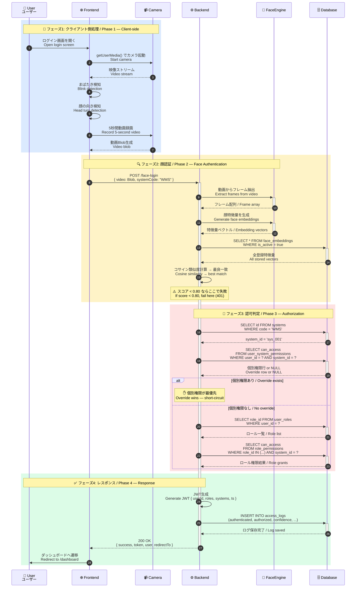
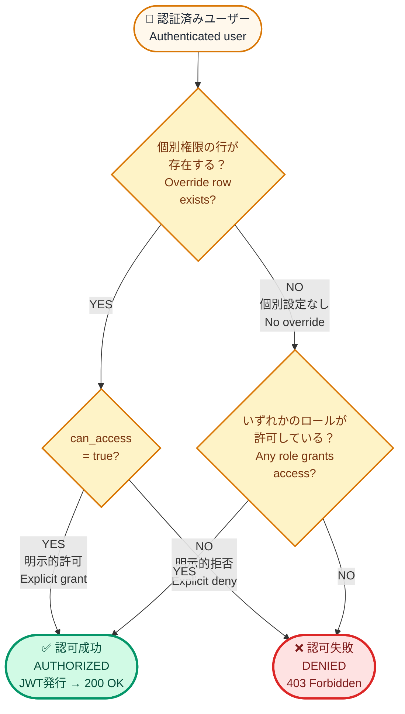
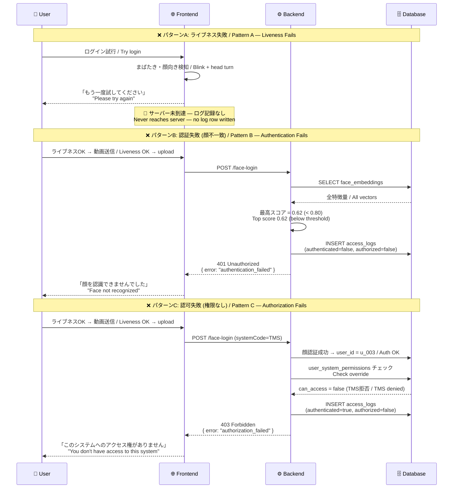
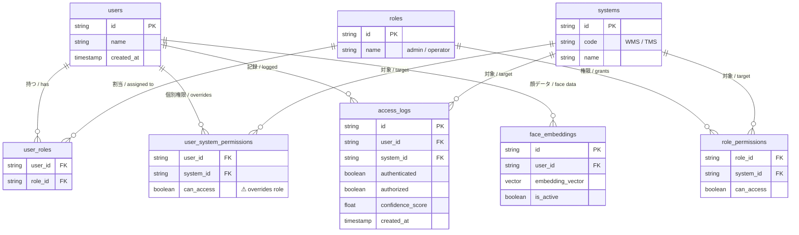

# 顔認証API シーケンス図 / Face Authentication API Sequence Diagrams

> このドキュメントは `Doc.md` の補足資料です。API内部処理の流れを視覚的に把握するために使用します。 
> This document supplements `Doc.md`. Use it to visually understand the API's internal processing flow.

すべての図は **Mermaid** 記法で書かれており、GitHub・GitLab・Notion・VSCode等で自動レンダリングされます。プレビューには [mermaid.live](https://mermaid.live) も使用できます。 
All diagrams are written in **Mermaid** notation and render automatically in GitHub, GitLab, Notion, VSCode, and similar tools. For previewing, [mermaid.live](https://mermaid.live) also works.

---

## 📋 凡例 / Legend

| アイコン / Icon | 役割 / Role | 説明 / Description |
|:---:|---|---|
| 👤 | **User** ユーザー | エンドユーザー / End user logging into WMS or TMS |
| 🌐 | **Frontend** フロントエンド | ブラウザ上で動作するログイン画面 / Browser-side login UI |
| 📹 | **Camera** カメラ | `getUserMedia()` 経由のWebカメラ / Webcam via `getUserMedia()` |
| ⚙️ | **Backend** バックエンド | `/face-login` を提供するAPIサーバー / API server hosting `/face-login` |
| 🧠 | **FaceEngine** 顔認証エンジン | フレーム抽出と特徴量照合 / Frame extraction & embedding matching |
| 🗄️ | **Database** データベース | PostgreSQL等のRDBMS / RDBMS such as PostgreSQL |

---

## 1️⃣ 全体シーケンス / Complete Sequence

### 成功パス / Happy Path

ユーザーがログインに成功するまでの完全なフローです。フェーズごとに色分けしてあります。 
The complete flow from user action to successful login. Color-coded by phase.

### 各フェーズの責任 / Phase Responsibilities

| # | フェーズ / Phase | 責任 / Responsibility |
|:-:|---|---|
| 1 | **クライアント側** Client-side | ライブネス検証と動画キャプチャ。サーバーに到達する前に「なりすまし」を排除。 Liveness verification + video capture. Filters out spoof attempts before they hit the server. |
| 2 | **顔認証** Face Auth | 「あなたは誰か？」を判定。一致しなければ **401**。 Answers "who are you?". Fails with **401** if no match. |
| 3 | **認可判定** Authorization | 「そのシステムにアクセスできるか？」を判定。失敗時は **403**。 Answers "can you access this system?". Fails with **403**. |
| 4 | **レスポンス** Response | JWT発行とログ保存。**成功・失敗にかかわらずログは必ず記録される**。 JWT issuance and log persistence. **Logs are written regardless of outcome.** |

---

## 2️⃣ 認可優先順位 / Authorization Priority

### このAPIの最も重要なルール / The Most Important Rule of This API

> **`user_system_permissions` は `role_permissions` を上書きします。** 
> **`user_system_permissions` overrides `role_permissions`.**

つまり、管理者ロールを持っていても、そのユーザーに対して個別に `can_access = false` の設定があれば、アクセスは拒否されます。逆も同様です。 
This means: even if a user has the admin role, an explicit `can_access = false` entry in `user_system_permissions` will **deny** access. The reverse also applies.

### 具体例 / Concrete Examples

| ユーザー / User | ロール / Role | 個別権限 / Override | リクエスト / Request | 結果 / Result |
|---|---|---|---|---|
| Rem | operator | `WMS = true` | WMS | ✅ **個別許可で成功** Allowed via override |
| Hiroshi | admin | （なし / none） | TMS | ✅ **ロール許可で成功** Allowed via admin role |
| Anna | admin | `TMS = false` | TMS | ❌ **個別拒否が優先** Denied — override beats admin role |
| Anna | admin | `TMS = false` | WMS | ✅ **TMSの拒否はWMSに無関係** TMS deny doesn't affect WMS |

---

## 3️⃣ 失敗パターン / Failure Modes

ハッピーパス以外の3つの失敗パターンを示します。どこで失敗するかによって、HTTPステータスと `access_logs` の内容が変わります。 
Three failure modes besides the happy path. Where the failure occurs determines both the HTTP status and what gets written to `access_logs`.

### `access_logs` の見方 / Reading `access_logs`

ログには2つのブール値があり、これによって失敗の種類が一目で分かります。 
The log has two boolean flags that make the failure type immediately readable:

| `authenticated` | `authorized` | 意味 / Meaning |
|:-:|:-:|---|
| ❌ `false` | ❌ `false` | 顔が認識されなかった (401) / Face not recognized — 401 |
| ✅ `true`  | ❌ `false` | 認識されたがアクセス権なし (403) / Recognized but no access — 403 |
| ✅ `true`  | ✅ `true`  | ログイン成功 (200) / Login successful — 200 |
| ❌ `false` | ✅ `true`  | ⚠️ 発生しないはず / Should never occur — investigate if seen |

> **重要 / Important**: ライブネス失敗時はサーバーに到達しないため、ログには残りません。ライブネス問題を追跡したい場合はクライアント側テレメトリが必要です。 
> When liveness fails, the request never reaches the server, so nothing is logged. Client-side telemetry is required if you want to track liveness issues.

---

## 4️⃣ データベース関係図 / Database Relationships

認可判定で参照される4つのテーブルの関係です。 
Relationships between the four tables consulted during authorization.

---

## 📖 使い方 / How to Use This Document

### チーム間の使い方 / Team-to-Team Usage

**API提供チーム / Producing team:**
- このファイルを `Doc.md` の隣に置き、コード変更時に図も更新する 
  Keep this file next to `Doc.md` and update the diagrams when code changes.
- 新しい失敗パターンが追加されたら、パターンD・E…として図3に追加する 
  When new failure modes are introduced, add them as Pattern D, E… to Diagram 3.

**API利用チーム / Consuming team:**
- 統合バグが発生したら、まずこの図のどのステップで何が起きたかを特定する 
  When integration bugs occur, first identify *which step* in the diagram is misbehaving.
- 「Step 13で `user_system_permissions` のチェックがおかしい」のように、具体的なステップで会話する 
  Discuss issues at the step level: "Step 13's `user_system_permissions` check seems off" rather than vague reports.

### レンダリング / Rendering

| ツール / Tool | 対応 / Support |
|---|---|
| GitHub (README, .md files) | ✅ ネイティブ対応 / Native |
| GitLab | ✅ ネイティブ対応 / Native |
| Notion | ✅ `/code` → Mermaid を選択 / Use `/code` block with Mermaid |
| VSCode | ✅ Markdown Preview Mermaid Support 拡張 / extension |
| Confluence | ✅ Mermaid マクロ / Mermaid macro |
| プレビュー / Preview | [mermaid.live](https://mermaid.live) |

### バージョン履歴 / Version History

| 日付 / Date | 変更 / Change |
|---|---|
| 2026-05-26 | 初版作成 / Initial version |

---

このドキュメントは <code>Doc.md</code> の付録です / This document is an appendix to <code>Doc.md</code>

