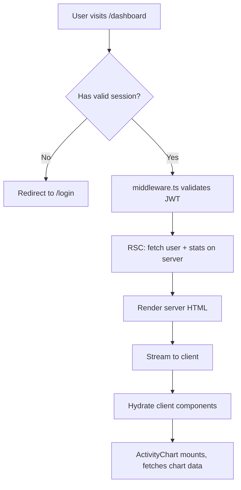
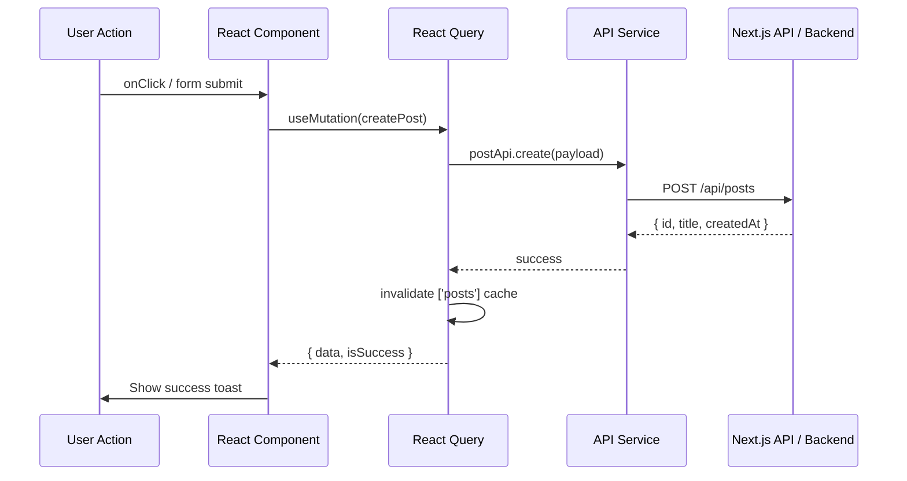

# 🖥️ Frontend Documentation Plan
### React / Next.js Applications

> **Goal:** Document every part of the frontend — components, pages, state, API calls, rendering strategies, and deployment — so any developer can onboard fast and work confidently.

---

## 📌 Overview

We maintain **5 core documentation sets** for frontend projects:

| # | Type | Purpose |
|---|------|---------|
| 1 | **Project Architecture** | Folder structure, conventions, and key decisions |
| 2 | **Component Documentation** | Every reusable component documented with props & examples |
| 3 | **Page & Route Documentation** | Every route/page, its rendering strategy, and data flow |
| 4 | **State & Data Flow** | How state is managed and how data moves through the app |
| 5 | **DevOps & Deployment** | CI/CD, Docker, environments, monitoring |

---

## 1️⃣ Project Architecture Documentation

### Recommended Folder Structure (Next.js App Router)

```
src/
├── app/                        # Next.js App Router (routes live here)
│   ├── layout.tsx              # Root layout (fonts, providers, global UI)
│   ├── page.tsx                # Home page  "/"
│   ├── loading.tsx             # Global loading state (Suspense fallback)
│   ├── error.tsx               # Global error boundary
│   ├── not-found.tsx           # 404 page
│   │
│   ├── (auth)/                 # Route group — auth pages (no shared layout)
│   │   ├── login/page.tsx
│   │   └── register/page.tsx
│   │
│   └── dashboard/              # Protected dashboard route
│       ├── layout.tsx          # Dashboard-specific layout (sidebar, nav)
│       ├── page.tsx
│       └── settings/page.tsx
│
├── components/                 # All reusable UI components
│   ├── ui/                     # Primitives (Button, Input, Modal, Badge...)
│   ├── shared/                 # Cross-feature components (Navbar, Footer...)
│   └── icons/                  # SVG icon components
│
├── features/                   # Feature-based modules (scalable approach)
│   ├── auth/
│   │   ├── components/         # Auth-specific UI (LoginForm, OTPInput...)
│   │   ├── hooks/              # useAuth, useSession...
│   │   ├── services/           # API calls (authApi.ts)
│   │   ├── store/              # Zustand/Redux slice for auth state
│   │   └── types/              # AuthUser, LoginPayload types
│   │
│   └── dashboard/
│       ├── components/
│       ├── hooks/
│       └── services/
│
├── hooks/                      # Global custom hooks (useFetch, useDebounce...)
├── lib/                        # Utility libraries (axios instance, zod schemas...)
├── store/                      # Global state (Zustand stores or Redux store)
├── types/                      # Global TypeScript types and interfaces
├── constants/                  # App-wide constants (routes, config values)
├── styles/                     # Global CSS, Tailwind config, theme tokens
└── middleware.ts               # Next.js middleware (auth guards, redirects)
```

---

### Architecture Decision Records (ADRs)

Keep a `docs/decisions/` folder. Document every major architectural choice.

**Template:**
```markdown
# ADR-001: [Decision Title]

**Date:** YYYY-MM-DD
**Status:** Accepted | Superseded | Deprecated

## Context
What problem were we solving?

## Options Considered
| Option | Pros | Cons |
|--------|------|------|
| Option A | ... | ... |
| Option B | ... | ... |

## Decision
We chose Option A because...

## Consequences
- ✅ Positive: ...
- ⚠️ Trade-off: ...
```

**Decisions to document for every project:**
- Why Next.js App Router vs Pages Router
- Why Zustand vs Redux vs React Query
- Why Tailwind vs CSS Modules vs Styled Components
- Why Axios vs native fetch
- Why Vercel vs self-hosted Docker

---

## 2️⃣ Component Documentation

### What Every Component Doc Should Include

For every reusable component in `components/ui/` or `components/shared/`:

| Field | Description |
|-------|-------------|
| **Purpose** | One-line description of what it does |
| **Props table** | Name, type, default, required, description |
| **Usage examples** | Basic, with variants, edge cases |
| **Accessibility notes** | ARIA roles, keyboard behavior |
| **Dependencies** | Other components or libraries it relies on |
| **Storybook story** | Link or embedded story |

---

### ✅ Example — Button Component

**File:** `components/ui/Button.tsx`

**Purpose:** Primary interactive element. Supports multiple variants, sizes, loading states, and full accessibility.

**Props:**

| Prop | Type | Default | Required | Description |
|------|------|---------|----------|-------------|
| `variant` | `'primary' \| 'secondary' \| 'ghost' \| 'danger'` | `'primary'` | No | Visual style |
| `size` | `'sm' \| 'md' \| 'lg'` | `'md'` | No | Button size |
| `isLoading` | `boolean` | `false` | No | Shows spinner, disables interaction |
| `disabled` | `boolean` | `false` | No | Disables the button |
| `onClick` | `() => void` | — | No | Click handler |
| `children` | `React.ReactNode` | — | Yes | Button label |
| `type` | `'button' \| 'submit' \| 'reset'` | `'button'` | No | HTML button type |

**Usage Examples:**

```tsx
// Basic
<Button>Click me</Button>

// Danger action with loading state
<Button variant="danger" isLoading={isDeleting} onClick={handleDelete}>
  Delete Account
</Button>

// Form submit
<Button type="submit" size="lg" disabled={!isValid}>
  Save Changes
</Button>
```

**Accessibility:**
- Uses native `<button>` element — keyboard focusable by default
- `aria-disabled` set when `disabled` or `isLoading` is true
- Loading spinner has `aria-label="Loading"` and `role="status"`

---

### Storybook Setup

Storybook is the source of truth for component documentation. Every component in `components/ui/` must have a `.stories.tsx` file.

**Install:**
```bash
npx storybook@latest init
# For Next.js with Vite (recommended 2025):
npm install --save-dev @storybook/nextjs-vite
```

**Story template:**
```tsx
// Button.stories.tsx
import type { Meta, StoryObj } from '@storybook/react';
import { Button } from './Button';

const meta: Meta<typeof Button> = {
  title: 'UI/Button',
  component: Button,
  tags: ['autodocs'],          // enables auto-generated docs page
  argTypes: {
    variant: { control: 'select' },
    size: { control: 'radio' },
  },
};
export default meta;

type Story = StoryObj<typeof Button>;

export const Primary: Story = {
  args: { children: 'Click me', variant: 'primary' },
};

export const Loading: Story = {
  args: { children: 'Saving...', isLoading: true },
};

export const Danger: Story = {
  args: { children: 'Delete', variant: 'danger' },
};
```

**Run Storybook:**
```bash
npm run storybook        # http://localhost:6006
npm run build-storybook  # static build for deployment
```

---

## 3️⃣ Page & Route Documentation

### Rendering Strategy — Quick Reference

| Strategy | When to Use | Next.js Usage |
|----------|------------|---------------|
| **SSG** (Static Site Generation) | Content rarely changes (landing, docs, blog) | `generateStaticParams()` |
| **SSR** (Server-Side Rendering) | Content per-request, personalized, SEO critical | `export const dynamic = 'force-dynamic'` |
| **ISR** (Incremental Static Regen) | Content changes but not per-user (product pages) | `revalidate = 60` (seconds) |
| **CSR** (Client-Side Rendering) | Highly interactive, no SEO needed (dashboard charts) | `'use client'` + `useEffect` |
| **RSC** (React Server Components) | Default — reduce JS bundle, server-only data | Default in App Router |

---

### What Every Page Doc Should Include

| Field | Description |
|-------|-------------|
| **Route** | URL path, e.g. `/dashboard/settings` |
| **Rendering strategy** | SSG / SSR / ISR / CSR / RSC |
| **Auth required** | Yes / No + redirect behavior |
| **Data fetched** | Which APIs, what shape |
| **SEO metadata** | Title, description, OG tags |
| **Key components used** | List of major components on the page |
| **Error states** | Loading, empty, error UI handled |

---

### ✅ Example — Dashboard Page

**Route:** `/dashboard`

**Rendering Strategy:** RSC (server component) + CSR islands for charts

**Auth Required:** Yes — redirects to `/login` if no session

**Data Fetched:**
```ts
// Server component fetch — runs on server, zero client JS
const user = await getUser(session.userId);
const stats = await getDashboardStats(session.userId);
```

**SEO:**
```ts
export const metadata: Metadata = {
  title: 'Dashboard | AppName',
  description: 'View your activity and stats',
  robots: { index: false },     // private page — don't index
};
```

**Key Components:**
- `<StatsCard />` — server component, no hydration
- `<ActivityChart />` — `'use client'`, recharts
- `<RecentTable />` — server component with Suspense

**Error Handling:**
```tsx
// app/dashboard/error.tsx — catches unhandled errors
// app/dashboard/loading.tsx — Suspense fallback
// Empty state handled in each component
```

---

### Route Architecture Diagram (Mermaid)



---

## 4️⃣ State & Data Flow Documentation

### State Management Decision Guide

```
Is the state only used in one component?
  └── YES → useState / useReducer  (local state)

Is the state shared across a feature?
  └── YES → Zustand store per feature  (feature state)

Is the state server data (API responses)?
  └── YES → TanStack Query (React Query)  (server state)

Is the state global UI (theme, auth user)?
  └── YES → Zustand global store  (global state)
```

---

### What to Document for Every Store

```ts
// docs/state/auth-store.md  — or inline JSDoc in the store file

/**
 * AUTH STORE
 *
 * Manages authenticated user state across the app.
 *
 * State shape:
 *   user: AuthUser | null
 *   isLoading: boolean
 *   error: string | null
 *
 * Actions:
 *   login(credentials) → calls authApi, sets user, stores token
 *   logout()           → clears user, removes token, redirects /login
 *   refreshToken()     → silently refreshes JWT before expiry
 *
 * Consumers:
 *   - middleware.ts (auth guard)
 *   - Navbar (shows user avatar)
 *   - ProfilePage (shows/edits user data)
 */
```

---

### Data Flow Diagram — API Call Lifecycle



---

### API Service Documentation

Every API service file in `features/*/services/` should be documented:

```ts
// features/auth/services/authApi.ts

/**
 * AUTH API SERVICE
 * Base URL: /api/auth
 * All requests use the shared axios instance (lib/axios.ts)
 * Token is auto-attached via request interceptor
 */

/**
 * Login with email and password
 * POST /api/auth/login
 * @returns AuthResponse { token, user }
 * @throws 401 if credentials invalid
 * @throws 429 if rate limited (5 attempts / 15 min)
 */
export const login = (data: LoginPayload): Promise<AuthResponse> =>
  api.post('/auth/login', data);
```

---

## 5️⃣ DevOps & Deployment Documentation

### Environments

| Environment | Branch | URL | Purpose |
|-------------|--------|-----|---------|
| `development` | `feature/*` | `localhost:3000` | Local dev |
| `preview` | `develop` | `preview.yourapp.com` | QA / stakeholder review |
| `staging` | `staging` | `staging.yourapp.com` | Pre-prod testing |
| `production` | `main` | `yourapp.com` | Live users |

**Environment variables** — never commit `.env.local`. Document every variable:

```bash
# .env.example  (commit this — it's just keys, no values)

NEXT_PUBLIC_API_URL=          # Backend base URL (exposed to browser)
NEXT_PUBLIC_APP_URL=          # Frontend URL (for OG tags, callbacks)
DATABASE_URL=                  # Postgres connection string (server-only)
NEXTAUTH_SECRET=               # Random 32-char secret for session signing
NEXTAUTH_URL=                  # Must match deployment URL
SENTRY_DSN=                    # Error tracking (server-only)
NEXT_PUBLIC_SENTRY_DSN=        # Error tracking (client-side)
```

---

### 🐳 Docker Setup (Self-Hosted / EC2)

**`Dockerfile`** — multi-stage build for minimal image size:
```dockerfile
# Stage 1: Install dependencies
FROM node:20-alpine AS deps
WORKDIR /app
COPY package*.json ./
RUN npm ci --only=production

# Stage 2: Build
FROM node:20-alpine AS builder
WORKDIR /app
COPY --from=deps /app/node_modules ./node_modules
COPY . .
RUN npm run build

# Stage 3: Production runner (standalone output)
FROM node:20-alpine AS runner
WORKDIR /app
ENV NODE_ENV=production

COPY --from=builder /app/.next/standalone ./
COPY --from=builder /app/.next/static ./.next/static
COPY --from=builder /app/public ./public

EXPOSE 3000
CMD ["node", "server.js"]
```

> ⚠️ **Required in `next.config.js`:**
> ```js
> module.exports = { output: 'standalone' }
> ```
> This reduces the Docker image from ~1GB to ~200MB by only including what's needed.

**`docker-compose.yml`:**
```yaml
version: '3.9'
services:
  web:
    build: .
    ports:
      - "3000:3000"
    environment:
      - NODE_ENV=production
      - NEXT_PUBLIC_API_URL=${NEXT_PUBLIC_API_URL}
    restart: unless-stopped

  nginx:
    image: nginx:alpine
    ports:
      - "80:80"
      - "443:443"
    volumes:
      - ./nginx.conf:/etc/nginx/nginx.conf
      - /etc/letsencrypt:/etc/letsencrypt
    depends_on:
      - web
    restart: unless-stopped
```

---

### 🔀 Nginx Configuration

```nginx
server {
    listen 80;
    server_name yourapp.com;
    return 301 https://$host$request_uri;
}

server {
    listen 443 ssl;
    server_name yourapp.com;

    ssl_certificate     /etc/letsencrypt/live/yourapp.com/fullchain.pem;
    ssl_certificate_key /etc/letsencrypt/live/yourapp.com/privkey.pem;

    # Next.js app
    location / {
        proxy_pass         http://web:3000;
        proxy_http_version 1.1;
        proxy_set_header   Upgrade $http_upgrade;
        proxy_set_header   Connection 'upgrade';  # WebSocket + streaming
        proxy_set_header   Host $host;
        proxy_cache_bypass $http_upgrade;
    }

    # Cache static assets
    location /_next/static/ {
        proxy_pass  http://web:3000;
        add_header  Cache-Control "public, max-age=31536000, immutable";
    }

    # Cache public folder
    location /images/ {
        proxy_pass  http://web:3000;
        add_header  Cache-Control "public, max-age=86400";
    }
}
```

---

### 🔁 CI/CD Pipeline — GitHub Actions

**Full pipeline: lint → test → build → deploy**

```yaml
# .github/workflows/deploy.yml
name: CI/CD Pipeline

on:
  push:
    branches: [main, develop]
  pull_request:
    branches: [main]

jobs:
  # ─── QUALITY CHECKS ────────────────────────────────────────
  lint-and-type-check:
    runs-on: ubuntu-latest
    steps:
      - uses: actions/checkout@v4
      - uses: actions/setup-node@v4
        with: { node-version: '20', cache: 'npm' }
      - run: npm ci
      - run: npm run lint
      - run: npm run type-check     # tsc --noEmit

  # ─── TESTS ────────────────────────────────────────────────
  test:
    runs-on: ubuntu-latest
    steps:
      - uses: actions/checkout@v4
      - uses: actions/setup-node@v4
        with: { node-version: '20', cache: 'npm' }
      - run: npm ci
      - run: npm run test -- --coverage
      - run: npm run test:e2e        # Playwright

  # ─── LIGHTHOUSE CI ────────────────────────────────────────
  lighthouse:
    runs-on: ubuntu-latest
    needs: [lint-and-type-check]
    steps:
      - uses: actions/checkout@v4
      - run: npm ci && npm run build
      - uses: treosh/lighthouse-ci-action@v11
        with:
          uploadArtifacts: true
          temporaryPublicStorage: true
          budgetPath: ./lighthouse-budget.json

  # ─── BUILD & PUSH DOCKER IMAGE ────────────────────────────
  build:
    runs-on: ubuntu-latest
    needs: [lint-and-type-check, test]
    if: github.ref == 'refs/heads/main'
    steps:
      - uses: actions/checkout@v4
      - uses: docker/login-action@v3
        with:
          registry: ghcr.io
          username: ${{ github.actor }}
          password: ${{ secrets.GITHUB_TOKEN }}
      - uses: docker/build-push-action@v5
        with:
          push: true
          tags: ghcr.io/${{ github.repository }}:${{ github.sha }},ghcr.io/${{ github.repository }}:latest
          build-args: |
            NEXT_PUBLIC_API_URL=${{ secrets.NEXT_PUBLIC_API_URL }}

  # ─── DEPLOY TO SERVER ─────────────────────────────────────
  deploy:
    runs-on: ubuntu-latest
    needs: [build]
    if: github.ref == 'refs/heads/main'
    steps:
      - name: Deploy via SSH
        uses: appleboy/ssh-action@v1
        with:
          host: ${{ secrets.SERVER_HOST }}
          username: ${{ secrets.SERVER_USER }}
          key: ${{ secrets.SERVER_SSH_KEY }}
          script: |
            cd /opt/yourapp
            echo ${{ secrets.GITHUB_TOKEN }} | docker login ghcr.io -u ${{ github.actor }} --password-stdin
            docker pull ghcr.io/${{ github.repository }}:latest
            docker compose up -d --no-deps web
            docker image prune -f
```

---

### Lighthouse Performance Budget

```json
// lighthouse-budget.json — fail CI if performance regresses
[
  {
    "path": "/*",
    "timings": [
      { "metric": "first-contentful-paint",   "budget": 2000 },
      { "metric": "largest-contentful-paint",  "budget": 2500 },
      { "metric": "interactive",               "budget": 3500 },
      { "metric": "total-blocking-time",       "budget": 200 }
    ],
    "resourceSizes": [
      { "resourceType": "script",  "budget": 500 },
      { "resourceType": "total",   "budget": 1500 }
    ]
  }
]
```

---

### Vercel Deployment (Simpler Option)

```bash
# Install Vercel CLI
npm install -g vercel

# Link project
vercel link

# Deploy preview
vercel

# Deploy to production
vercel --prod
```

**GitHub + Vercel auto-deploy:** Push to `main` → Vercel builds and deploys automatically. PRs get unique preview URLs.

| Branch | Deployment |
|--------|-----------|
| `main` | Production — `yourapp.com` |
| `develop` | Preview — `yourapp-git-develop-team.vercel.app` |
| Any PR | Preview URL auto-generated |

---

## 📊 Performance Monitoring

### Core Web Vitals — Targets

| Metric | What It Measures | Good | Needs Work | Poor |
|--------|-----------------|------|------------|------|
| **LCP** (Largest Contentful Paint) | Loading speed | ≤ 2.5s | 2.5–4s | > 4s |
| **INP** (Interaction to Next Paint) | Interactivity | ≤ 200ms | 200–500ms | > 500ms |
| **CLS** (Cumulative Layout Shift) | Visual stability | ≤ 0.1 | 0.1–0.25 | > 0.25 |
| **FCP** (First Contentful Paint) | First render | ≤ 1.8s | 1.8–3s | > 3s |
| **TTFB** (Time to First Byte) | Server response | ≤ 800ms | 800ms–1.8s | > 1.8s |

> 💡 Only 48% of mobile origins pass all three Core Web Vitals (2025 Web Almanac). Measure your own — Lighthouse lab scores ≠ real user scores.

---

### What We Monitor

| What | Tool | Why |
|------|------|-----|
| Real User Monitoring (Core Web Vitals) | Sentry / Vercel Speed Insights | What real users experience |
| Error tracking (JS errors, crashes) | Sentry | Catch regressions early |
| Synthetic monitoring (uptime checks) | UptimeRobot / Checkly | Alert if site goes down |
| Performance regression in CI | Lighthouse CI | Fail builds before regressions reach production |
| Bundle size | `@next/bundle-analyzer` | Catch bloated dependencies |
| API response times | Sentry Performance | Frontend-to-backend correlation |

---

### Sentry Setup in Next.js

```bash
npx @sentry/wizard@latest -i nextjs
```

```ts
// sentry.client.config.ts
import * as Sentry from "@sentry/nextjs";

Sentry.init({
  dsn: process.env.NEXT_PUBLIC_SENTRY_DSN,
  tracesSampleRate: 0.2,          // 20% of transactions
  replaysOnErrorSampleRate: 1.0,  // 100% on errors
  replaysSessionSampleRate: 0.05, // 5% of sessions
});
```

---

### Bundle Size Analysis

```bash
# Add to next.config.js
const withBundleAnalyzer = require('@next/bundle-analyzer')({
  enabled: process.env.ANALYZE === 'true',
});
module.exports = withBundleAnalyzer({});

# Run
ANALYZE=true npm run build
```

Targets:
- First-load JS per route: **< 150 KB**
- Shared chunks: **< 100 KB**

---

## 🧪 Testing Documentation

### Testing Strategy

```
Unit Tests (Jest + Testing Library)
  → Individual components, hooks, utility functions
  → Target: 70%+ coverage on business logic

Integration Tests (Testing Library)
  → Full feature flows (login form → success state)
  → API call mocking with msw

E2E Tests (Playwright)
  → Critical user journeys only
  → Login, checkout, key form submissions
```

### What to Document Per Test Suite

```ts
// __tests__/features/auth/LoginForm.test.tsx

/**
 * LOGIN FORM — Test Suite
 *
 * Covers:
 *  ✅ Renders with empty fields
 *  ✅ Shows validation errors on empty submit
 *  ✅ Shows API error on wrong credentials
 *  ✅ Redirects to /dashboard on success
 *  ✅ Disables submit button while loading
 *  ✅ Accessible (all fields have labels)
 */
```

---

## 🛠️ Tools Used & Purpose

| Tool | Category | Purpose |
|------|----------|---------|
| **Next.js 15** | Framework | SSR, SSG, RSC, App Router, API routes |
| **TypeScript** | Language | Type safety across the entire codebase |
| **Tailwind CSS** | Styling | Utility-first CSS, no unused styles in prod |
| **Zustand** | State | Lightweight global state (no boilerplate) |
| **TanStack Query** | Data Fetching | Server state, caching, background refetching |
| **Axios** | HTTP Client | Request/response interceptors, base URL config |
| **Zod** | Validation | Schema validation for forms and API responses |
| **React Hook Form** | Forms | Performant forms with Zod integration |
| **Storybook** | Component Docs | Isolated component development and documentation |
| **Jest + RTL** | Unit Testing | Component and hook unit tests |
| **Playwright** | E2E Testing | Browser automation for critical user journeys |
| **ESLint + Prettier** | Code Quality | Consistent code style, enforced in CI |
| **Sentry** | Monitoring | Error tracking + Core Web Vitals in production |
| **Docker** | Containerization | Consistent build and deployment environment |
| **Nginx** | Reverse Proxy | SSL, static asset caching, WebSocket support |
| **GitHub Actions** | CI/CD | Automated lint → test → build → deploy pipeline |
| **Lighthouse CI** | Performance | Enforce performance budgets in every PR |

---

## 📁 Full Docs Folder Structure

```
docs/
├── architecture/
│   ├── folder-structure.md         # Explained folder structure
│   ├── system-flow.md              # Mermaid: full request lifecycle
│   ├── auth-flow.md                # Mermaid: auth sequence
│   ├── state-diagram.md            # Mermaid: state management overview
│   └── rendering-strategy.md       # Which pages use SSR vs SSG vs CSR
│
├── components/
│   ├── Button.md
│   ├── Modal.md
│   └── ...                         # One file per reusable component
│
├── pages/
│   ├── dashboard.md
│   ├── login.md
│   └── ...                         # One file per route/page
│
├── state/
│   ├── auth-store.md
│   └── ...                         # One file per Zustand store
│
├── decisions/
│   ├── ADR-001-app-router.md
│   ├── ADR-002-zustand-over-redux.md
│   └── ...
│
├── devops/
│   ├── environments.md             # Env vars, environment differences
│   ├── docker-setup.md             # Build + run instructions
│   ├── ci-cd-pipeline.md           # GitHub Actions walkthrough
│   └── monitoring.md               # Sentry, Lighthouse setup
│
└── performance/
    ├── bundle-analysis.md          # Bundle sizes per release
    └── web-vitals.md               # Core Web Vitals per environment
```

---

## 🔄 What To Do DURING Development

### After Every New Component

- [ ] Props fully typed with TypeScript interface
- [ ] JSDoc comment on the component function
- [ ] Storybook `.stories.tsx` created with at least 3 states
- [ ] `docs/components/<ComponentName>.md` created or updated
- [ ] Accessible (tested with keyboard + screen reader at least once)

### After Every New Page/Route

- [ ] `docs/pages/<route-name>.md` created
- [ ] Rendering strategy chosen and documented
- [ ] SEO `metadata` export added (even for private pages with `robots: noindex`)
- [ ] `loading.tsx` and `error.tsx` handled
- [ ] Documented which APIs it calls

### After Every New Feature

- [ ] State management approach documented
- [ ] API service functions documented with JSDoc
- [ ] Tests written for key components/hooks
- [ ] Architecture diagram updated if data flow changed
- [ ] ADR filed if a significant technical decision was made

---

## ✅ Definition of Done (Frontend)

A feature is **not complete** until all boxes are checked:

```
[ ] Code reviewed and approved
[ ] TypeScript — zero type errors (tsc --noEmit passes)
[ ] ESLint — zero lint errors (npm run lint passes)
[ ] Unit tests written for business logic
[ ] Component tested in Storybook (all major states covered)
[ ] API service functions documented with JSDoc
[ ] Page/component markdown doc created or updated
[ ] Performance checked — no new Lighthouse regressions
[ ] Accessible — keyboard navigable, ARIA attributes correct
[ ] Works on mobile (tested at 375px width)
[ ] PR description includes: what changed, why, screenshots
```

> 💡 **Tip:** Add this as a PR template in `.github/pull_request_template.md` so it appears automatically on every pull request.

---

*Last updated: 2025 · Maintained by the frontend team*
