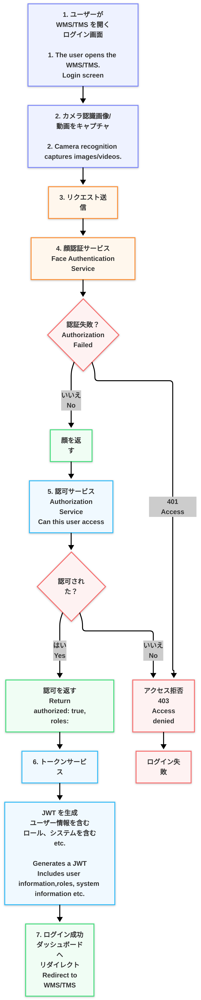
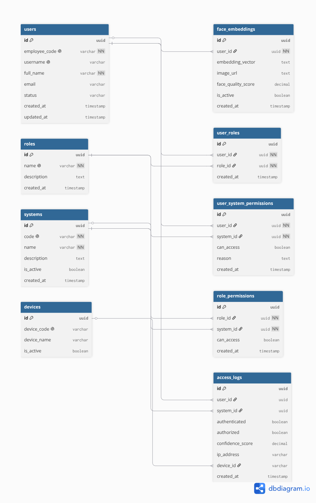
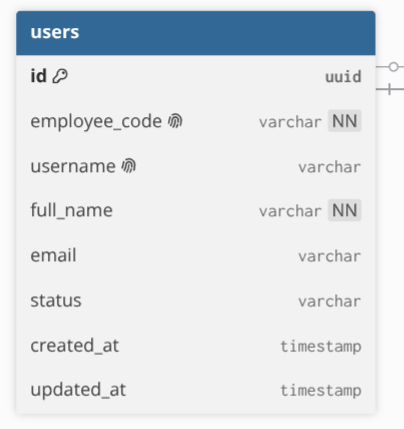
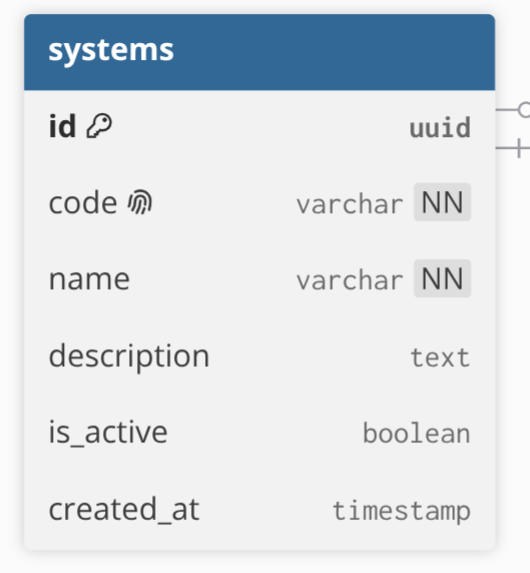
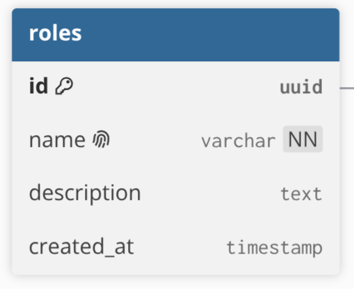

<div align="center">

<br/>

# 🔐 顔認証 API
### 複数システム認可プラットフォーム
##### Face Authentication API — Multi-System Authorization Platform

<br/>


<br/>

</div>

---

## 📋 目次
##### Table of Contents

- [システム概要 · System Overview](#-システム概要--system-overview)
- [全体フロー · Overall Flow](#-全体フロー--overall-flow)
- [データベース構成 · Database Structure](#️-データベース構成--database-structure)
- [テーブル一覧 · Table Definitions](#-テーブル一覧--table-definitions)
- [APIリファレンス · API Reference](#-apiリファレンス--api-reference)
- [処理ロジック · Processing Logic](#️-処理ロジック--processing-logic)
- [詳細クエリフロー · Detailed Query Flow](#-詳細クエリフロー--detailed-query-flow)
- [重要ポイント · Important Notes](#️-重要ポイント--important-notes)
- [今後の改善案 · Future Improvements](#-今後の改善案--future-improvements)

---

## 🧩 システム概要 · System Overview

このドキュメントは、**顔認証ログイン**および**複数システム認可**プラットフォームの全体仕様を説明します。

*This document describes the full specification of the **Face Authentication Login** and **Multi-System Authorization** platform.*

| 機能<br/>*Feature* | 説明<br/>*Description* |
|---|---|
| 🎥 顔認証ログイン<br/>*Face Login* | 5秒動画Blobで認証<br/>*Authenticate via 5-second Blob video* |
| 👁️ ライブネス検知<br/>*Liveness Detection* | まばたき＋顔向き確認<br/>*Blink + head turn verification* |
| 🏢 複数システム認可<br/>*Multi-System Auth* | WMS / TMS アクセス制御<br/>*WMS / TMS access control* |
| 🔑 JWT発行<br/>*JWT Issuance* | ロールとシステム情報を含むトークン<br/>*Token includes roles and accessible systems* |
| 📋 アクセスログ<br/>*Access Logging* | 全試行を `access_logs` に保存<br/>*All attempts saved to `access_logs`* |

---

## 🔄 全体フロー · Overall Flow

<div align="center">

<!-- Adjust width here → FLOW_IMG_WIDTH = 520px -->


*図1 — 全体フロー · Figure 1 — Overall system flow*

</div>

### フロー概要 · Flow Summary

```
① ログイン画面表示          →  ユーザーが WMS/TMS ログイン画面を開く
   Open Login Screen        →  User opens WMS/TMS login page

② カメラ起動                →  フロントエンドがカメラを起動する
   Camera Starts            →  Frontend initializes camera

③ ライブネス確認             →  まばたき検知 + 顔向き検知
   Liveness Check           →  Blink detection + head turn detection

④ 動画録画                  →  5秒間の顔動画を録画
   Record Video             →  5-second face video captured

⑤ Blob変換                  →  録画動画をBlobオブジェクトに変換
   Convert to Blob          →  Video converted to Blob object

⑥ API送信                   →  BlobをバックエンドAPIへ送信
   Send to API              →  Blob uploaded to backend

⑦ 動画解析                  →  バックエンドが動画からフレームを抽出
   Frame Extraction         →  Backend extracts frames from video

⑧ 顔認証                    →  特徴量を生成し、登録データと照合
   Face Matching            →  Embeddings generated and compared

⑨ 権限確認                  →  対象システムへのアクセス権を確認
   Authorization Check      →  Verify access to requested system

⑩ JWT生成                   →  認証成功後にトークンを発行
   Generate JWT             →  Token issued on success

⑪ ログ保存                  →  結果を access_logs に保存
   Save Log                 →  Result saved to access_logs

⑫ ログイン完了               →  ダッシュボードへ遷移
   Redirect                 →  User redirected to dashboard
```

---

## 🗄️ データベース構成 · Database Structure

<div align="center">

<!-- Adjust width here → ER_IMG_WIDTH = 700px -->


*図2 — ER図 · Figure 2 — Entity Relationship Diagram*

</div>

---

## 📦 テーブル一覧 · Table Definitions

<details>
<summary><strong>users</strong> — ユーザー基本情報 · User base information</summary>
<br/>

<!-- Adjust width here → TABLE_IMG_WIDTH = 360px -->


</details>

<details>
<summary><strong>face_embeddings</strong> — 顔特徴量ベクトル · Facial feature vectors</summary>
<br/>

<!-- Adjust width here → TABLE_IMG_WIDTH = 360px -->


</details>

<details>
<summary><strong>systems</strong> — WMS / TMS システム情報 · System info</summary>
<br/>

<!-- Adjust width here → TABLE_IMG_WIDTH = 360px -->


</details>

<details>
<summary><strong>roles</strong> — ロール定義 · Role definitions</summary>
<br/>

<!-- Adjust width here → TABLE_IMG_WIDTH = 360px -->


</details>

<details>
<summary><strong>user_roles</strong> — ユーザーとロールの紐付け · User ↔ role mapping</summary>
<br/>

<!-- Adjust width here → TABLE_IMG_WIDTH = 360px -->


</details>

<details>
<summary><strong>role_permissions</strong> — ロール別アクセス権限 · Role-based access control</summary>
<br/>

<!-- Adjust width here → TABLE_IMG_WIDTH = 360px -->


</details>

<details>
<summary><strong>user_system_permissions</strong> — ユーザー個別権限override · Per-user override permissions</summary>
<br/>

<!-- Adjust width here → TABLE_IMG_WIDTH = 360px -->


</details>

<details>
<summary><strong>access_logs</strong> — ログイン履歴 · Login history</summary>
<br/>

<!-- Adjust width here → TABLE_IMG_WIDTH = 360px -->


</details>

---

## 🚀 APIリファレンス · API Reference

### エンドポイント · Endpoint

```http
POST /face-login
```

> **Content-Type:** `multipart/form-data`

---

### リクエスト & レスポンス · Request & Response

<table>
<tr>
<th width="50%">📤 リクエスト · Request</th>
<th width="50%">📥 レスポンス · Response</th>
</tr>
<tr>
<td>

```json
{
  "video": "Blob (5 seconds)",
  "systemCode": "WMS"
}
```

</td>
<td>

```json
{
  "success": true,
  "token": "jwt_token_here",
  "user": {
    "id": "u_001",
    "name": "Rem"
  },
  "redirectTo": "/dashboard"
}
```

</td>
</tr>
<tr>
<td>

| フィールド<br/>*Field* | 型<br/>*Type* | 説明<br/>*Description* |
|---|---|---|
| `video` | `Blob` | 5秒間の顔動画<br/>*5-second face recording* |
| `systemCode` | `string` | 対象システム<br/>*Target system (`WMS` / `TMS`)* |

</td>
<td>

| フィールド<br/>*Field* | 型<br/>*Type* | 説明<br/>*Description* |
|---|---|---|
| `success` | `boolean` | 認証結果<br/>*Auth result* |
| `token` | `string` | JWTアクセストークン<br/>*JWT access token* |
| `user.id` | `string` | 照合されたユーザーID<br/>*Matched user ID* |
| `redirectTo` | `string` | ログイン後リダイレクト先<br/>*Post-login redirect path* |

</td>
</tr>
</table>

---

### エラーレスポンス · Error Responses

| ステータス<br/>*Status* | コード<br/>*Code* | 説明<br/>*Meaning* |
|---|---|---|
| `401` | `FACE_NOT_MATCHED` | 顔が一致しない<br/>*No matching face found* |
| `403` | `ACCESS_DENIED` | システムへのアクセス権なし<br/>*User lacks system permission* |
| `422` | `LIVENESS_FAILED` | まばたき / 顔向きが検知されない<br/>*Blink / head-turn not detected* |
| `500` | `PROCESSING_ERROR` | フレーム抽出に失敗<br/>*Frame extraction failed* |

---

## ⚙️ 処理ロジック · Processing Logic

```
 1.  ユーザーがログイン画面を開く            / User opens login screen
 2.  フロントエンドがカメラを起動            / Frontend starts camera
 3.  まばたき検知を実行                     / Blink detection runs
 4.  顔向き検知を実行                       / Head turn detection runs
 5.  フロントエンドが5秒の顔動画を録画       / Frontend records 5-second face video
 6.  動画をBlobに変換                       / Video converted into Blob
 7.  Blobをバックエンドへアップロード        / Blob uploaded to backend
 8.  バックエンドが動画からフレームを抽出    / Backend extracts frames from video
 9.  フレームから顔の特徴量を生成           / Face embeddings generated from frames
10.  保存済み face_embeddings と照合        / Compare with stored face_embeddings
11.  最も一致するユーザーを返す             / Return best matched user
12.  リクエストの systemCode を読み取る     / Read requested systemCode
13.  user_system_permissions を確認         / Check user_system_permissions  ← ロール権限より優先 / overrides role permissions
14.  role_permissions を確認                / Check role_permissions
15.  JWTトークンを生成                     / Generate JWT token
16.  access_logs にINSERT                  / Insert into access_logs
17.  ログインレスポンスを返す               / Return login response
18.  ダッシュボードへリダイレクト           / Redirect to dashboard
```

---

## 🔍 詳細クエリフロー · Detailed Query Flow

<div align="center">


</div>

### Step 1 — 顔認証 · Face Matching

```sql
SELECT
  user_id,
  embedding_vector
FROM face_embeddings
WHERE is_active = true;
```

> アップロードされた動画から抽出した特徴量を、保存済みの全アクティブベクトルと照合します。
>
> *Compare embeddings extracted from the uploaded video against all active stored vectors.*

---

### Step 2 — システム取得 · Find System

```sql
SELECT id
FROM systems
WHERE code = 'WMS';
```

> リクエストの `systemCode` から内部システムIDを取得します。
>
> *Resolve `systemCode` from the request to an internal system ID.*

---

### Step 3 — ユーザー個別権限確認 · Check User Override Permission

```sql
SELECT can_access
FROM user_system_permissions
WHERE user_id = 'u_001'
  AND system_id = 'sys_001';
```

> ユーザー個別権限はロール権限より**優先**されます。
>
> *User-level permission takes **priority** over role-based permission.*

---

### Step 4 — ユーザーロール取得 · Get User Roles

```sql
SELECT role_id
FROM user_roles
WHERE user_id = 'u_001';
```

> ユーザーに割り当てられたロールを取得します。
>
> *Retrieve all roles assigned to the matched user.*

---

### Step 5 — ロール権限確認 · Check Role Permissions

```sql
SELECT can_access
FROM role_permissions
WHERE role_id IN (...)
  AND system_id = 'sys_001';
```

> ロールに基づいたシステムアクセス権を確認します。
>
> *Check system access based on the user's assigned roles.*

---

### Step 6 — JWT生成 · Generate JWT

JWTペイロードに含まれる情報 · *JWT payload includes:*

```json
{
  "userId": "u_001",
  "roles": ["admin", "operator"],
  "accessibleSystems": ["WMS", "TMS"],
  "loginTimestamp": "2026-05-26T10:00:00Z"
}
```

---

### Step 7 — アクセスログ保存 · Save Access Log

```sql
INSERT INTO access_logs (
  user_id,
  system_id,
  authenticated,
  authorized,
  confidence_score,
  created_at
)
VALUES (...);
```

> 認証結果（成功・失敗）をすべて記録します。
>
> *All authentication results (success and failure) are saved.*

---

### Step 8 — レスポンス返却 · Return Response

ログイン成功レスポンスを返し、ユーザーを `/dashboard` へリダイレクトします。

*Login success response returned. User redirected to `/dashboard`.*

---

## ⚠️ 重要ポイント · Important Notes

> [!IMPORTANT]
> - 顔データは静止画ではなく **5秒動画Blob** で送信されます<br/>*Face data is uploaded as a **5-second Blob video**, not a static image*
> - **まばたき検知**はライブネスチェックの必須条件です<br/>***Blink detection** is required to pass liveness check*
> - **顔向き検知**はライブネスチェックの必須条件です<br/>***Head turn detection** is required to pass liveness check*
> - フレーム抽出はサーバー側で顔照合の前に実施されます<br/>*Frame extraction happens server-side before any face matching*
> - `user_system_permissions` は `role_permissions` より**優先**されます<br/>*`user_system_permissions` **overrides** `role_permissions`*
> - JWTには `roles` と `accessibleSystems` が含まれます<br/>*JWT contains `roles` and `accessibleSystems`*
> - **全ログイン試行**（成功・失敗問わず）が `access_logs` に保存されます<br/>***All login attempts** (success and failure) are saved to `access_logs`*

---

## 🔮 今後の改善案 · Future Improvements

- [ ] 顔認証の信頼度スコアしきい値のチューニング<br/>*Face recognition confidence threshold tuning*
- [ ] 多要素認証フォールバック（PIN / OTP）<br/>*Multi-factor fallback (PIN / OTP)*
- [ ] ライブネススコアのリアルタイムフィードバック<br/>*Real-time liveness score feedback to frontend*
- [ ] アクセスログ確認用の管理ダッシュボード<br/>*Admin dashboard for access log review*

---

<div align="center">

*顔認証API — 内部ドキュメント · Face Authentication API — Internal Documentation*

</div>
