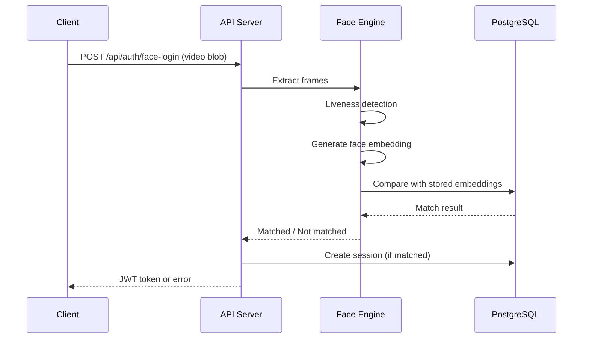

# 📋 Team Documentation Plan

> **Goal:** Make our project documentation clear, reliable, and self-explanatory — no follow-up questions needed.

---

## 📌 Overview

We maintain **3 core documentation sets** throughout development:

| # | Type | Purpose |
|---|------|---------|
| 1 | **API Function Logic** | Describes every API endpoint in detail |
| 2 | **System Working Specification** | Describes how the whole system behaves |
| 3 | **Tools & Purpose** | What tools we use and why |

---

## 1️⃣ API Function Logic Documentation

Document **every API endpoint** with the following structure.

### Required Fields per API

| Field | Description |
|-------|-------------|
| `Endpoint URL` | Full path, e.g. `/api/auth/face-login` |
| `Method` | `GET`, `POST`, `PUT`, `DELETE` |
| `Purpose` | One-line description of what it does |
| `Auth Required` | Yes / No + type (JWT, API Key, etc.) |
| `Request Headers` | `Content-Type`, `Authorization`, etc. |
| `Request Body` | JSON schema + field descriptions |
| `Validation Rules` | Required fields, format rules, constraints |
| `Business Logic Flow` | Step-by-step what the API does internally |
| `Success Response` | Example JSON response |
| `Error Response` | Example error JSON with status codes |
| `DB Tables Touched` | Which tables are read/written |
| `External Services` | S3, Twilio, third-party APIs, etc. |
| `Notes / Limitations` | Rate limits, known edge cases, etc. |

---

### ✅ Example — Face Login API

**`POST /api/auth/face-login`**

**Purpose:** Authenticate a user using face recognition via video blob.

**Auth Required:** No (this is the auth step itself)

**Request Headers:**
```http
Content-Type: multipart/form-data
```

**Request Body:**
```json
{
  "videoBlob": "<binary>",
  "userId": "123"
}
```

**Validation Rules:**
- `videoBlob` is required, must be a valid video file
- `userId` is required, must exist in the database

**Business Logic Flow:**
```
1. Receive video blob from frontend
2. Extract frames from video
3. Run liveness detection
   ├── Blink detection
   └── Head turn detection
4. Generate face embedding from frames
5. Compare embedding against stored embeddings
6. If match found:
   ├── Generate JWT token
   └── Create login session
7. Return response
```

**Success Response** `200 OK`:
```json
{
  "success": true,
  "token": "eyJhbGciOiJIUzI1NiIsInR5cCI6IkpXVCJ9...",
  "userId": "123"
}
```

**Error Responses:**

| Status | Reason | Response |
|--------|--------|----------|
| `401` | Face not recognized | `{ "success": false, "message": "Face not recognized" }` |
| `400` | Invalid video blob | `{ "success": false, "message": "Invalid video input" }` |
| `422` | Liveness check failed | `{ "success": false, "message": "Liveness detection failed" }` |

**DB Tables Touched:** `users`, `face_embeddings`, `login_sessions`

**External Services:** OpenCV, face-api.js

---

## 2️⃣ System Working Specification

> This is what **clients and management** ask for. It explains the full system behavior with real measurable numbers.

### 🔐 Authentication

| Type | Details |
|------|---------|
| Password | Hashed with bcrypt (12 rounds) |
| Face Recognition | Video blob → liveness → embedding match |
| OTP | Time-based, 5-minute expiry |
| Token Expiry | JWT valid for 24 hours |
| Session Timeout | Auto-logout after 30 minutes of inactivity |

---

### ⚡ Performance

| Metric | Average | Maximum |
|--------|---------|---------|
| Full authentication (end-to-end) | 1.8 sec | 3.0 sec |
| Face matching | 600 ms | 900 ms |
| Liveness detection | 1.2 sec | 2.0 sec |
| API response time (non-auth) | 120 ms | 500 ms |

---

### 📦 Capacity

| Metric | Value |
|--------|-------|
| Max registered users | 50,000 |
| Concurrent auth requests | 200 |
| Average throughput | 120 req/sec |
| Storage per user (embeddings) | ~15 KB |

---

### 🔒 Security

- ✅ JWT authentication with token rotation
- ✅ HTTPS with TLS 1.3 encryption
- ✅ Passwords hashed with bcrypt
- ✅ AES-256 encryption for sensitive data at rest
- ✅ Role-based access control (RBAC)
- ✅ API rate limiting (100 req/min per IP)
- ✅ IP allowlisting for admin endpoints
- ✅ Secure, HttpOnly cookies
- ✅ CSRF token protection

---

### 🗄️ Storage Architecture

| Data Type | Storage |
|-----------|---------|
| User data & sessions | PostgreSQL |
| Video blobs | Amazon S3 |
| Face embeddings | PostgreSQL (vector column) |
| Cache & session tokens | Redis |

---

### 🚀 Deployment

| Component | Technology |
|-----------|-----------|
| Application | Docker containers |
| Reverse proxy | Nginx |
| Cloud hosting | AWS EC2 |
| Process manager | PM2 |
| CI/CD pipeline | GitHub Actions |

---

### 📊 Monitoring

| What We Monitor | Alert Threshold |
|-----------------|----------------|
| Server CPU usage | > 80% sustained |
| RAM usage | > 85% |
| API response time | > 2 sec |
| Error rate | > 1% of requests |
| Failed login attempts | > 10 in 60 sec (triggers lockout) |

---

## 3️⃣ Tools & Purpose

| Tool | Category | Purpose |
|------|----------|---------|
| **Docker** | Infrastructure | Containerized, consistent deployments |
| **Nginx** | Infrastructure | Reverse proxy, SSL termination, load balancing |
| **PostgreSQL** | Database | Primary relational data store |
| **Redis** | Cache | Session storage, caching, rate limit counters |
| **Amazon Web Services** | Cloud | EC2 hosting, S3 blob storage |
| **GitHub Actions** | CI/CD | Automated testing and deployment pipeline |
| **Postman** | Testing | API testing, request collection, documentation |
| **OpenCV** | AI/Vision | Frame extraction from video, image processing |
| **face-api.js** | AI/Vision | Face detection, landmark detection, embedding generation |
| **Mermaid** | Docs | Architecture and flow diagrams as code |
| **Swagger/OpenAPI** | Docs | Auto-generated interactive API documentation |

---

## 🔄 What To Do DURING Development

> Do this as you build — it saves enormous time later.

### 📁 Folder Structure to Maintain

```
docs/
├── api/                    # One .md file per API endpoint
│   ├── face-login.md
│   ├── register-user.md
│   └── verify-liveness.md
│
├── examples/               # Sample payloads for every API
│   ├── face-login/
│   │   ├── request.json
│   │   ├── response.json
│   │   └── error-response.json
│   └── ...
│
├── architecture/           # Diagrams
│   ├── system-flow.md      # Mermaid: full system flow
│   ├── api-flow.md         # Mermaid: API request lifecycle
│   ├── db-schema.md        # Mermaid: entity-relationship diagram
│   └── auth-sequence.md    # Mermaid: auth sequence diagram
│
├── decisions/              # Why we chose what we chose (ADRs)
│   ├── postgresql-over-mongodb.md
│   ├── jwt-over-sessions.md
│   └── video-blob-over-image.md
│
└── performance/            # Measured numbers per feature
    └── face-auth-benchmarks.md
```

---

### ✍️ After Every New API — Checklist

- [ ] Created `docs/api/<endpoint-name>.md`
- [ ] Saved `docs/examples/<endpoint>/request.json`
- [ ] Saved `docs/examples/<endpoint>/response.json`
- [ ] Saved `docs/examples/<endpoint>/error-response.json`
- [ ] Recorded response time and DB query time in `docs/performance/`
- [ ] Updated architecture diagram if flow changed

---

### 📐 Architecture Diagram Example (Mermaid)



---

### 📝 Architecture Decision Record (ADR) Template

```markdown
# Decision: [Title]

**Date:** YYYY-MM-DD
**Status:** Accepted

## Context
What problem were we trying to solve?

## Options Considered
1. Option A — pros/cons
2. Option B — pros/cons

## Decision
We chose Option A because...

## Consequences
- Positive: ...
- Negative: ...
```

**Example decisions to document:**
- Why PostgreSQL instead of MongoDB
- Why JWT instead of server-side sessions
- Why video blob instead of static image for face auth

---

### ⏱️ Performance Logging Example

```markdown
# Face Auth — Performance Benchmarks

**Date:** 2025-01-15
**Environment:** AWS EC2 t3.medium

| Step | Average | Notes |
|------|---------|-------|
| Frame extraction | ~80ms | 5 frames from 3s video |
| Liveness detection | ~1.2s | blink + head turn |
| Face embedding | ~200ms | face-api.js |
| DB embedding comparison | ~100ms | 50k users |
| **Total** | **~1.58s** | Within 1.8s target ✅ |
```

---

## 🛠️ For Already Finished Projects

Catch up on documentation using this 5-step audit:

### Step 1 — Discover All APIs
```bash
# Find all route definitions
grep -r "router\." src/ --include="*.js"
grep -r "@app.route" src/ --include="*.py"

# Or check route files directly
ls src/routes/
```

### Step 2 — Test APIs with Postman
- Import all routes into a Postman collection
- Run each endpoint, capture:
  - Request body
  - Success response
  - Error response (try invalid inputs)
- Export the collection as JSON → save in `docs/`

### Step 3 — Document DB Schema
```sql
-- PostgreSQL: get all tables and columns
SELECT table_name, column_name, data_type
FROM information_schema.columns
WHERE table_schema = 'public'
ORDER BY table_name, ordinal_position;
```
Then convert to a Mermaid ER diagram in `docs/architecture/db-schema.md`.

### Step 4 — Collect Real Performance Numbers
```bash
# Simple load test with k6
k6 run --vus 50 --duration 30s scripts/load-test-auth.js

# Or use curl timing
curl -o /dev/null -s -w "Total: %{time_total}s\n" \
  -X POST https://api.example.com/api/auth/face-login
```

### Step 5 — Generate Diagrams from Existing Code
- Trace the request lifecycle manually through the code
- Draw it in Mermaid (sequence or flowchart)
- Save under `docs/architecture/`

---

## 📚 What the Team Should Learn

### 🔴 Highest Priority

| Tool | Why |
|------|-----|
| **OpenAPI / Swagger** | Write standardized API specs that auto-generate interactive docs |
| **Postman** | API testing + shareable collections + documentation |
| **Mermaid** | Write diagrams as code — version-controlled, no drag-and-drop tools needed |

**Quick start — OpenAPI example:**
```yaml
openapi: 3.0.0
info:
  title: Face Auth API
  version: 1.0.0
paths:
  /api/auth/face-login:
    post:
      summary: Authenticate using face recognition
      requestBody:
        content:
          multipart/form-data:
            schema:
              properties:
                videoBlob:
                  type: string
                  format: binary
      responses:
        '200':
          description: Authentication successful
          content:
            application/json:
              example:
                success: true
                token: "jwt-token-here"
                userId: "123"
```

### 🟡 Learn Next

| Tool | Why |
|------|-----|
| **Grafana** | Visual dashboards for CPU, RAM, API latency, error rates |
| **Prometheus** | Collect and store system metrics from the app |
| **k6** | Load testing — simulate 200 concurrent users hitting auth |

---

## ✅ Definition of Done

A feature is **not complete** until all boxes are checked:

```
[ ] Code finished and reviewed
[ ] API tested (happy path + error cases)
[ ] Sample request payload saved
[ ] Sample response payload saved
[ ] API markdown doc written/updated
[ ] Performance numbers recorded
[ ] Architecture diagram updated (if flow changed)
[ ] Decision documented (if a significant choice was made)
```

> 💡 **Tip:** Add this checklist to your PR template so it runs automatically on every pull request.

---

*Last updated: 2025 · Maintained by the dev team*
